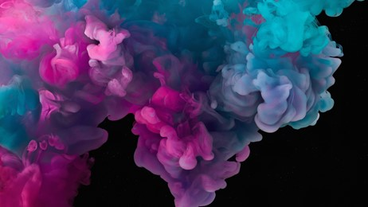

# Image-Segmentation

* Extracted the dominant colour and segmented the image using KMeans.  
* Libraries used - Matplotlib, Numpy, OpenCV, Scikit-Learn.

## Original Image : 

## Dominant Colours extracted :

## Image segmentation :

